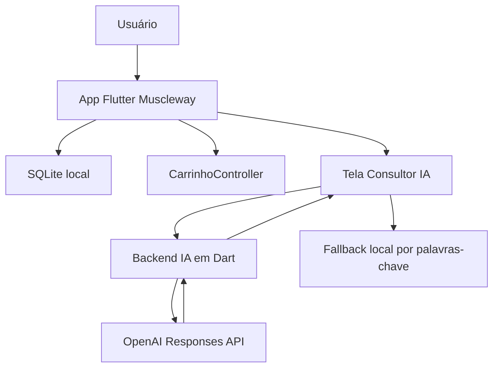

# Diagrama de Arquitetura

## Explicação

O aplicativo Flutter concentra a interface e as regras principais do app. O
SQLite guarda usuários e produtos. O carrinho fica em memória por meio do
CarrinhoController. A tela de IA chama o backend local, que consulta a OpenAI.
Caso o backend ou a API falhe, o app usa o fallback local.
