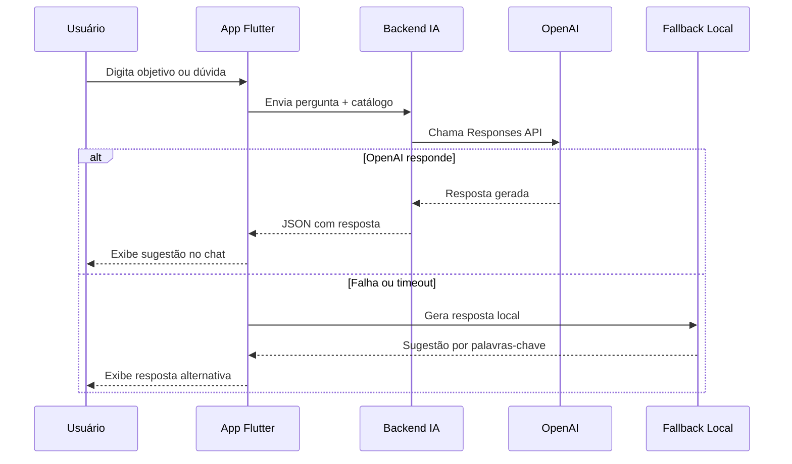

# Fluxo da IA

```mermaid
sequenceDiagram
    participant U as Usuário
    participant A as App Flutter
    participant B as Backend IA
    participant O as OpenAI
    participant F as Fallback Local

    U->>A: Digita objetivo ou dúvida
    A->>B: Envia pergunta + catálogo
    B->>O: Chama Responses API
    alt OpenAI responde
        O-->>B: Resposta gerada
        B-->>A: JSON com resposta
        A-->>U: Exibe sugestão no chat
    else Falha ou timeout
        A->>F: Gera resposta local
        F-->>A: Sugestão por palavras-chave
        A-->>U: Exibe resposta alternativa
    end
```

## Observação

A chave da OpenAI fica somente no backend, no arquivo `.env`, e não é enviada
para o GitHub.
